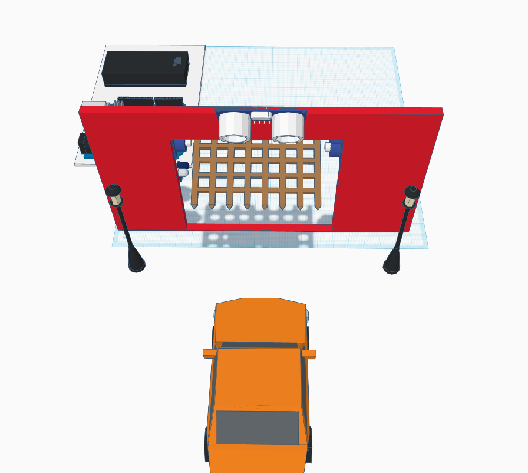
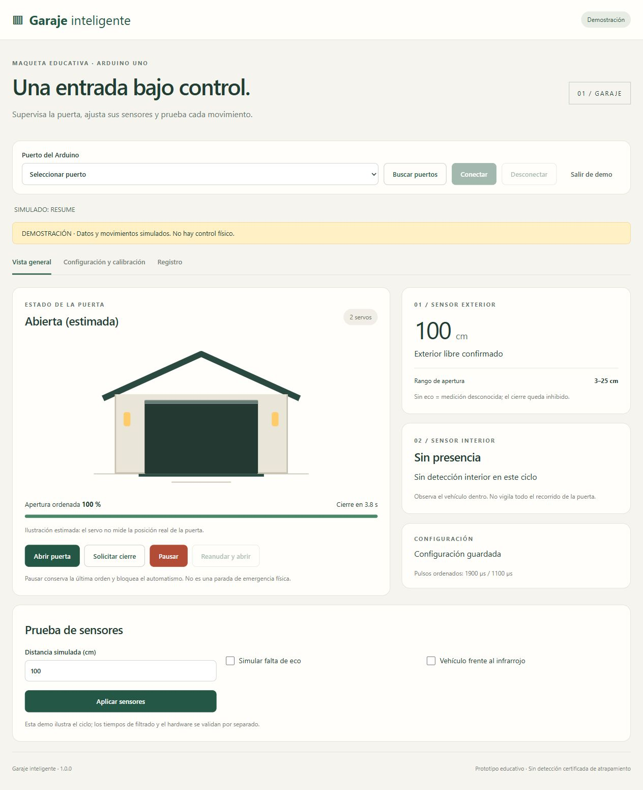
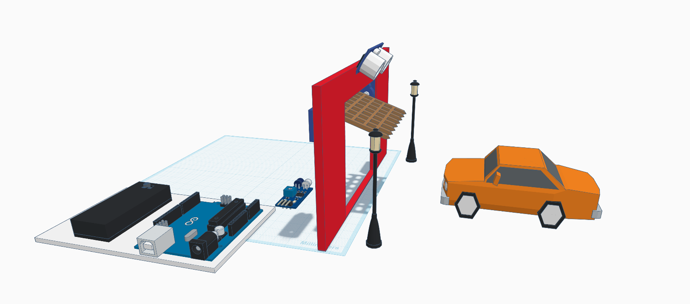
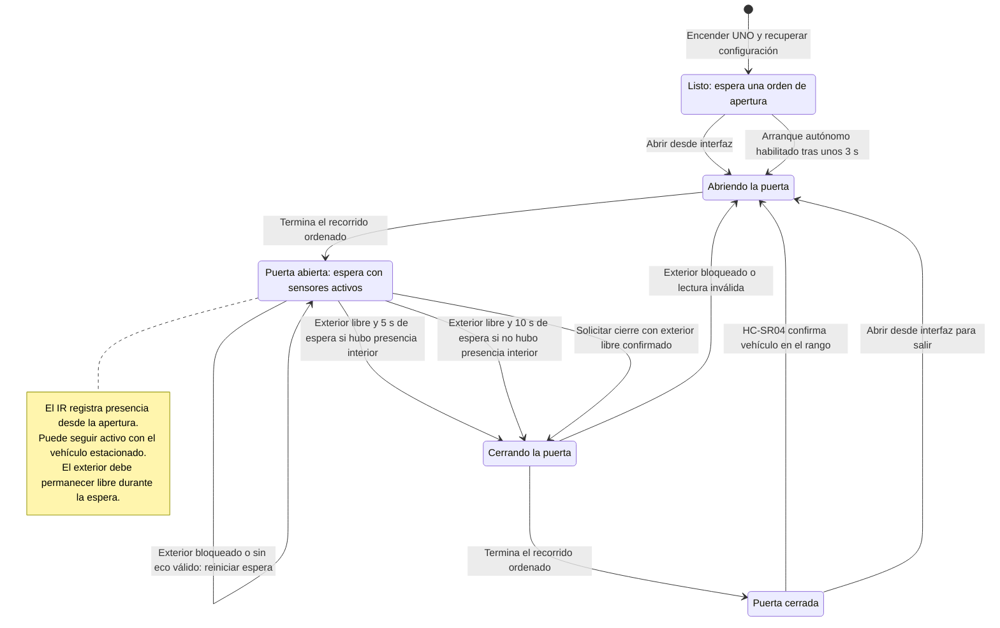
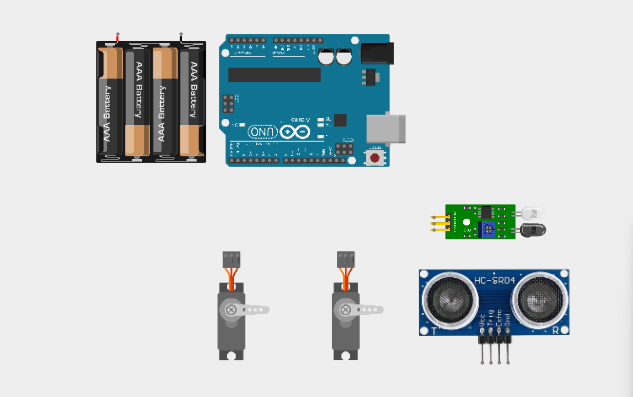
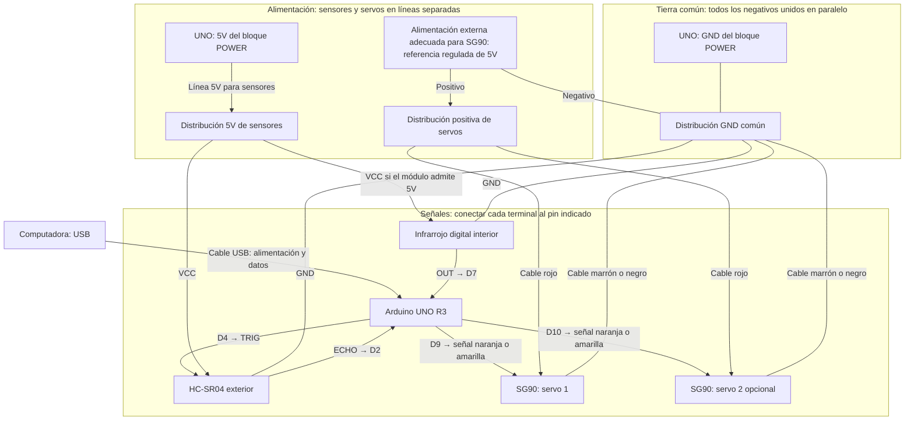
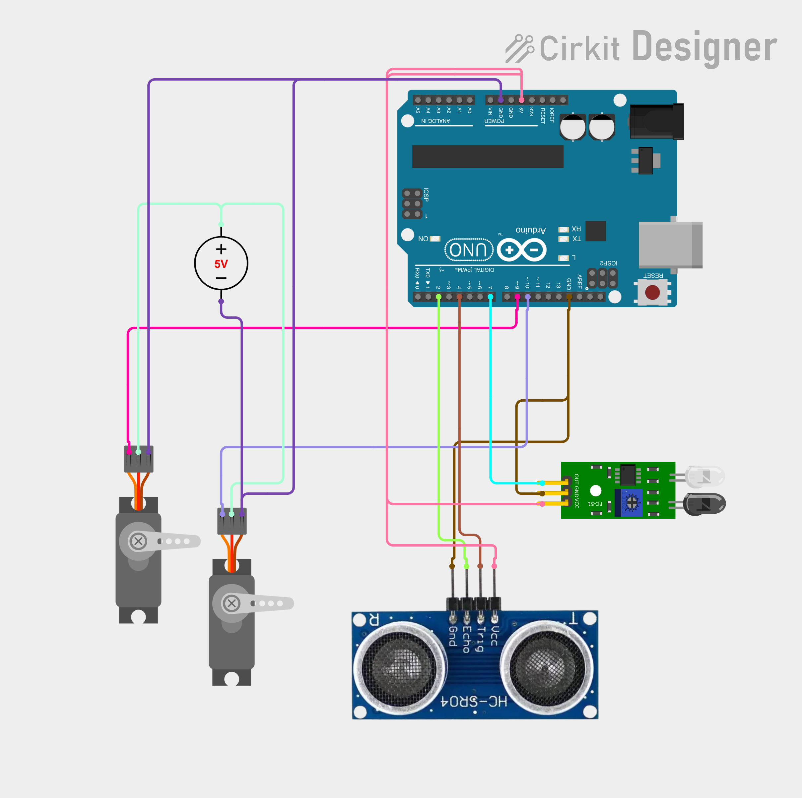
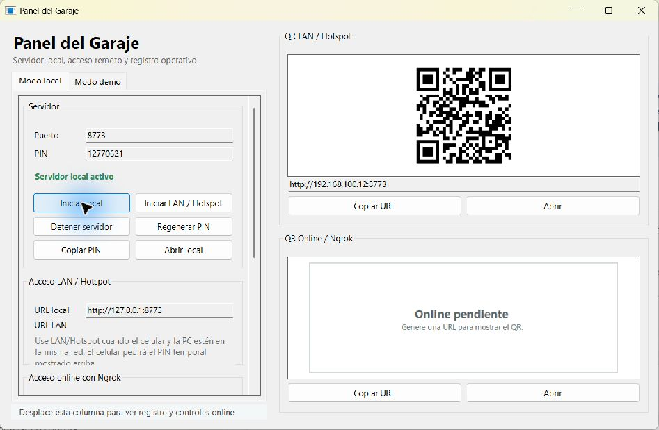

# Domótica Garaje Inteligente · CELE

Maqueta educativa con Arduino UNO, HC-SR04, sensor infrarrojo y uno o dos servos SG90. Incluye firmware autónomo, interfaz web en español y panel para Windows con acceso local o LAN.



El diseño muestra el vehículo frente al acceso y los sensores distribuidos entre exterior e interior. Sigue la [guía ilustrada paso a paso](docs/GUIA_ILUSTRADA.md) para identificar componentes, leer las vistas y preparar el montaje.



## ¿Cómo funciona?

El **HC-SR04 exterior** detecta un vehículo de juguete dentro del rango configurado y permite abrir cuando la puerta está cerrada. El **infrarrojo interior** registra que hubo presencia durante la apertura o la espera. Los **servos SG90** mueven la puerta con extremos calibrados individualmente.

Una vez abierta, la puerta espera a que el exterior esté libre y después cierra. Si el exterior se bloquea o el ultrasónico pierde el eco durante el cierre, se ordena reabrir. Para salir, se solicita la apertura desde la interfaz.



**Lectura de la imagen:** vehículo exterior → detección por HC-SR04 → orden de apertura → servos elevan la puerta. Después, la detección interior y el exterior libre determinan la espera para cerrar. La captura ilustra la geometría; las mediciones y el movimiento deben comprobarse en la maqueta real.

### Esquema 1 · Flujo del funcionamiento

Las flechas describen el programa del UNO. Las aperturas requieren calibración y pausa liberada.



Los valores iniciales del firmware son ajustables desde la interfaz:

| Condición o ajuste | Valor inicial | Efecto |
|---|---|---|
| Vehículo exterior | Entre 3 y 25 cm durante 300 ms | Permite abrir desde puerta cerrada |
| Exterior libre | Eco válido a más de 30 cm durante 1500 ms | Habilita la espera para cerrar |
| Presencia interior registrada | 5 s con exterior libre | Cierre después de la entrada |
| Sin presencia interior registrada | 10 s con exterior libre | Cierre por aproximación abandonada |
| Recorrido | 2500 ms | Duración de la progresión de las órdenes a los servos |
| Cantidad de servos | 1; segundo opcional | Se selecciona en mantenimiento |
| Arranque autónomo y calibración confirmada | Desactivados | La primera puesta en marcha requiere calibrar y ordenar apertura |

Una distancia inferior al mínimo también bloquea el cierre. Durante el cierre, la reapertura se ordena ante una lectura inválida o una distancia que no supere el límite de exterior libre, sin esperar nuevamente los 1500 ms.

**Pausar / STOP** bloquea el ciclo y conserva la última orden de los servos; la pausa persiste tras un reinicio. **Reanudar y abrir** libera la pausa y ordena apertura. **Mantenimiento** retira las señales de los servos: hay que sostener la puerta mientras se calibra. El IR interior observa presencia; la maqueta no incorpora una barrera independiente en el umbral.

### Computadora, celular y Arduino

```text
Navegador en PC o celular
        ↕ HTTP: órdenes y estado (puerto 8773)
Servidor en la computadora ← Panel Windows: iniciar, detener, PIN y QR
        ↕ USB / puerto COM: 115200 baudios
Arduino UNO ↔ sensores
        ↓ señales de control
Uno o dos servos → puerta de la maqueta
```

El teléfono accede al servidor de la computadora por la misma red en modo LAN. El UNO ejecuta su ciclo mientras esté alimentado, incluso si se cierra el navegador o se detiene el servidor. La posición mostrada es **ordenada/estimada**; los SG90 no reportan la posición real.

## Esquema 2 · Conexiones de la maqueta



El esquema usa los **pines iniciales del firmware**. Si se cambiaron desde la interfaz, el cableado debe coincidir con la configuración guardada. Las flechas indican qué puntos se conectan y, en las señales, el sentido de comunicación; la tierra común es una unión eléctrica.



### Tabla rápida de cableado

| Componente / terminal | Conectar a |
|---|---|
| UNO, conector USB | Computadora mediante cable USB de datos |
| HC-SR04, TRIG | D4 del UNO |
| HC-SR04, ECHO | D2 del UNO |
| HC-SR04, VCC | Línea 5V desde POWER del UNO |
| HC-SR04, GND | Distribución GND común |
| Infrarrojo, OUT | D7 del UNO |
| Infrarrojo, VCC | Línea 5V desde POWER del UNO, si admite 5V |
| Infrarrojo, GND | Distribución GND común |
| Servo 1, señal naranja/amarilla | D9 del UNO |
| Servo 2 opcional, señal naranja/amarilla | D10 del UNO |
| Ambos servos, cable rojo | Positivo de la alimentación externa adecuada |
| Ambos servos, cable marrón/negro | Distribución GND común |
| Alimentación externa, negativo | Distribución GND común |
| UNO, GND del bloque POWER | Distribución GND común |

La distribución puede ser una línea o bornera: cada rama se conecta en paralelo. Los retornos de los servos se unen directamente al negativo de su fuente en esa distribución, para que la corriente de los motores no atraviese la placa UNO. El positivo externo de los servos queda separado del 5V, VIN y 3.3V del Arduino.

La fuente regulada de 5V del dibujo es una referencia de alimentación. **La compatibilidad de tus SG90 con cuatro pilas AA directas sigue pendiente de verificación**; el esquema no da por aprobada esa conexión ni por cambiada tu elección de portapilas. Confirma los rótulos de cada módulo: su orden físico de pines puede variar.

Para un solo servo, omite las ramas del servo 2 y selecciona **1 servo** en la interfaz. D10 permanece reservado por la configuración inicial. Si se usan dos servos enfrentados, calibra sus extremos por separado y con el eje desacoplado.

### Captura de Cirkit y corrección de tierra

**Antes de seguir la captura:** el cable marrón de GND de los sensores parece conectado a **D13**. Esa rama debe terminar en la **distribución GND común conectada al GND del bloque POWER**, junto al negativo de la fuente de servos. D13 es un pin digital y no sirve como sustituto de GND. El esquema Mermaid y la tabla anterior indican las conexiones que se deben seguir.



Se conserva la captura original para reconocer los cables. Sus colores difieren del esquema textual: identifica cada terminal por su rótulo, no solo por el color. La fuente marcada 5V representa la alimentación externa de servos. Consulta la [guía ilustrada](docs/GUIA_ILUSTRADA.md#4-leer-el-cableado-de-cirkit) para seguir las ramas.

## Empezar en Windows

**El punto de entrada del portable es `PanelGaraje.exe`.** El panel inicia el servidor; después **Abrir local** abre la interfaz donde seleccionas el COM y conectas el Arduino. No hace falta abrir `GarajeServidor.exe` por separado.

| Uso | Orden a seguir |
|---|---|
| Solo PC | Panel → **Iniciar local** → esperar estado activo → **Abrir local** → COM → **Conectar** |
| PC y celular en la misma red | Panel → **Iniciar LAN / Hotspot** → **Abrir local** y conectar COM → celular: **QR LAN → PIN** |
| Prueba sin Arduino | Panel → pestaña **Modo demo** → **Iniciar demo** |

Si ya iniciaste en local y quieres conectar el celular, pulsa **Detener servidor** antes de iniciar LAN. El modo LAN también permite usar la interfaz desde la PC. El botón LAN no crea un hotspot; PC y celular deben estar en una red que permita comunicarse.



Consulta la [guía del panel y conexión del celular, con capturas reales](docs/GUIA_PANEL_Y_CELULAR.md) para seguir cada paso. Los valores de IP y PIN de las capturas pertenecen a una sesión de prueba ya detenida: utiliza los de tu panel.

En [Releases](https://github.com/hfreedo/Domotica-Garaje-Inteligente/releases/tag/v1.0.2), descargar `GarajeInteligente_v1.0.2_Windows.zip`, extraer todo y abrir `PanelGaraje.exe`. Python y .NET vienen incluidos: el portable no requiere instalar sus dependencias.

Si el Arduino usa CH340 y no aparece su puerto COM, consultar `support/ch340/LEEME.md`. El release 1.0.2 incluye el instalador original del fabricante con firma verificada; nunca se ejecuta automáticamente.

Probar primero la demostración. Para montaje y calibración, leer [la guía](docs/MONTAJE_Y_CALIBRACION.md). Las pruebas físicas siguen pendientes; la posición mostrada es estimada y STOP conserva los pulsos, no corta la alimentación.

## Ejecutar desde fuentes

1. Instalar [Python 3.11 o posterior](https://www.python.org/downloads/windows/), con la opción **Add Python to PATH**.
2. Ejecutar `INSTALAR_DEPENDENCIAS.cmd`: crea `.venv` e instala `pyserial==3.5` con conexión a Internet.
3. Ejecutar `INICIAR_SERVIDOR.cmd`. Abre la interfaz en `http://127.0.0.1:8773`; cerrar con Ctrl+C.

El servidor por sí solo no necesita .NET. Para construir el panel y el portable, ver [instalación y compilación](docs/INSTALACION.md). El firmware usa Arduino UNO y la biblioteca Servo; su carga se hace explícitamente desde Arduino IDE.

## Documentación

- [Cómo iniciar el panel y conectar el celular, con capturas](docs/GUIA_PANEL_Y_CELULAR.md)
- [Guía ilustrada: componentes, maqueta, cableado y primer ensayo](docs/GUIA_ILUSTRADA.md)
- [Instalación, dependencias y solución de problemas](docs/INSTALACION.md)
- [Montaje y calibración](docs/MONTAJE_Y_CALIBRACION.md)
- [Acceso remoto opcional](docs/ACCESO_REMOTO.md)
- [Validación y límites de las pruebas](docs/VALIDACION.md)
- [Preparar GitHub y publicar un release](docs/PUBLICAR_GITHUB.md)
- [Notas del release 1.0.2](docs/RELEASE_1.0.2.md)
- [Investigación editable](investigacion/Guia_investigacion_garaje_Paraguay.docx) y [PDF](investigacion/Guia_investigacion_garaje_Paraguay.pdf)

La alimentación de los servos es externa y comparte GND con UNO. La compatibilidad de los SG90 concretos con cuatro AA directas está pendiente de verificación.

## Estructura y pruebas

`firmware/`: UNO; `interfaz_garaje/`: servidor y web; `panel_garaje/`: panel C#; `tests/`: pruebas; `scripts/` y `tools/`: instalación y empaquetado. `entregas/`, `.build/`, entornos virtuales y archivos privados quedan excluidos de Git.

```powershell
.venv/Scripts/python.exe -m unittest discover -s tests -p 'test_*.py'
node tests/test_servo_units.cjs
```

La licencia de publicación del código propio aún no está definida; no se concede una licencia de terceros en nombre de sus autores. Consultar [atribuciones](ATRIBUCIONES.md). Los componentes externos conservan sus términos respectivos.
