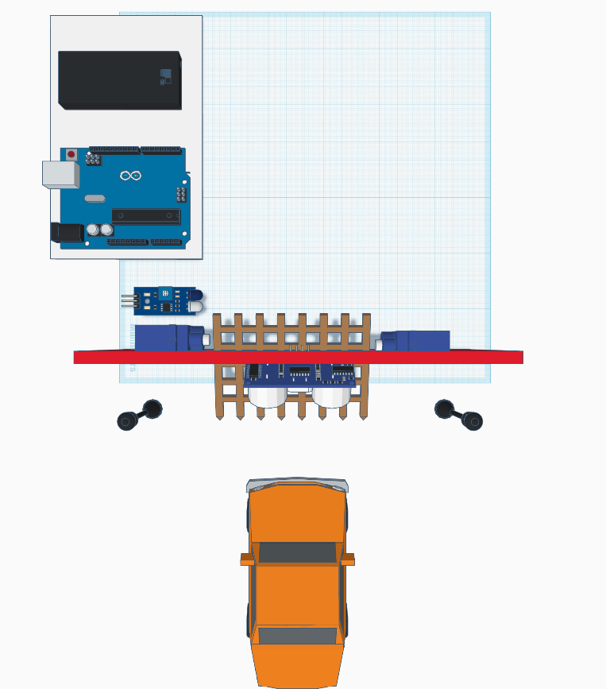
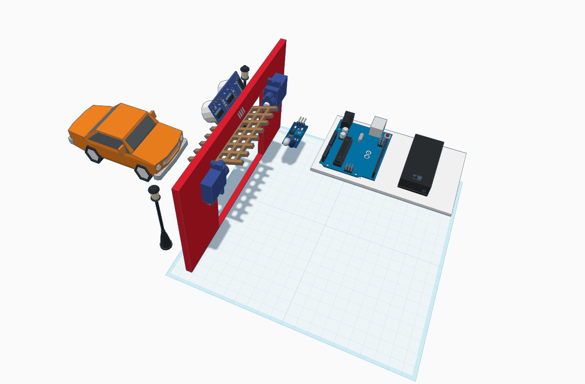
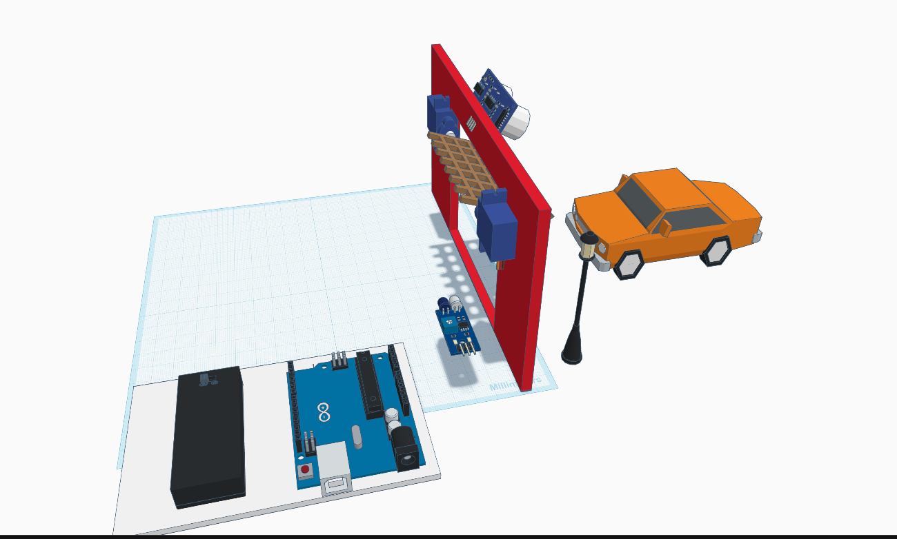

# Guía ilustrada · Domótica Garaje Inteligente

[Volver al README y sus diagramas con flechas](../README.md).

Para el orden de inicio en Windows y el acceso desde el teléfono, sigue [la guía del panel y celular con capturas reales](GUIA_PANEL_Y_CELULAR.md).

Esta guía utiliza las siete imágenes proporcionadas por el usuario. Las vistas 3D explican la disposición propuesta; el diagrama de Cirkit permite seguir las conexiones. Las imágenes no acreditan pruebas físicas ni lecturas de sensores.

## 1. Reconocer los componentes

| Qué identificar en la imagen | Para qué se usa | Qué comprobar antes de conectar |
|---|---|---|
| Arduino UNO R3, arriba | Ejecuta el control y comunica por USB con la computadora | Placa UNO, cable USB de datos y puerto COM |
| HC-SR04, abajo a la derecha | Mide la distancia exterior | Rótulos VCC, TRIG, ECHO y GND |
| Infrarrojo digital, derecha | Detecta presencia interior | Rótulos VCC, GND y OUT; compatibilidad con 5V |
| Dos servos, abajo | Accionan la puerta | Modelo SG90 posicional, tensión admitida y extremos útiles |
| Portapilas ilustrado, arriba a la izquierda | Representa una alimentación aparte para servos | Tamaño y tipo de pilas, polaridad y tensión real |

El portapilas de esta ilustración muestra rótulos **AAA**. La elección discutida para el montaje fue **cuatro AA**: verifica el portapilas real antes de comprar o conectar. Su compatibilidad directa con tus SG90 sigue pendiente. La fuente externa de 5V del esquema es una referencia de alimentación, no una confirmación de que las pilas entreguen esa tensión.

**Ubicación → función:** HC-SR04 exterior → detectar aproximación; IR interior → registrar presencia; servos → mover la puerta; UNO → coordinar el ciclo.

## 2. Entender la disposición de la maqueta

### Vista frontal: desde donde se aproxima el vehículo

El vehículo está fuera del garaje. El HC-SR04 se encuentra sobre el acceso, mirando hacia el exterior. La rejilla representa la puerta móvil y los soportes laterales alojan los actuadores. Los postes negros son elementos de la representación: el firmware documentado controla sensores y servos, sin una función de iluminación para esos postes.

La trayectoria prevista es **vehículo exterior → acceso → zona interior**. Comprueba que el recorrido de la puerta no golpee el vehículo ni tape el campo de medición del ultrasónico.

### Vista superior: separar exterior e interior

El automóvil está abajo, en el exterior; la plataforma detrás del marco rojo es el interior. Se distinguen los dos servos enfrentados y el infrarrojo situado dentro. El UNO y la caja negra están en una plataforma lateral: la imagen no identifica eléctricamente esa caja ni muestra sus conexiones.

Sitúa el IR donde realmente vea el vehículo al entrar o estacionar. Su presencia se recuerda durante el ciclo y puede continuar activa con el automóvil estacionado; por eso no funciona como barrera de protección del umbral.

### Vista interior: reconocer actuadores y sensor

La vista permite seguir el eje de la puerta y reconocer los servos en sus extremos. Cada servo necesita sus propios valores de abierto y cerrado. Si están enfrentados, normalmente uno aumenta el pulso mientras el otro lo disminuye. Calíbralos desacoplados antes de unirlos al mecanismo.

### Vista lateral: revisar espacios y recorridos

Comprueba desde este ángulo la separación entre la puerta, el sensor interior y la plataforma electrónica. Deja espacio para la apertura y para que ningún cable se enganche en el eje. Las vistas muestran una propuesta de montaje; la fuerza necesaria y el recorrido útil se determinan con el mecanismo real.

## 3. Relacionar la imagen con el ciclo del programa

La puerta elevada ayuda a visualizar el acceso liberado. Sigue esta secuencia con el [diagrama de flujo del README](../README.md#esquema-1--flujo-del-funcionamiento):

1. **Puesta en marcha:** cargar el firmware y calibrar. La configuración inicial deja desactivados el arranque autónomo y la confirmación de calibración. Ordenar apertura desde la interfaz después de calibrar y liberar la pausa.
2. **Vehículo frente a puerta cerrada:** el HC-SR04 confirma presencia en el rango inicial de 3–25 cm durante 300 ms y se ordena apertura.
3. **Puerta abierta:** el IR registra presencia interior durante la apertura o la espera. El exterior debe tener eco válido a más de 30 cm durante 1500 ms para confirmarse libre.
4. **Espera y cierre:** con exterior libre, esperar inicialmente 5 s si hubo presencia interior o 10 s si no la hubo. El plazo se reinicia si el exterior deja de estar libre.
5. **Durante el cierre:** si la lectura exterior deja de estar libre o es inválida, se ordena reabrir. Al completar el recorrido de cierre ordenado, el sistema vuelve a esperar el próximo vehículo.

Para salir, solicitar apertura desde la interfaz. El IR interior por sí solo no abre la puerta. La posición visible en pantalla es estimada a partir de las órdenes; estos servos no envían una medición de su ángulo real.

## 4. Leer el cableado de Cirkit

**Corrección necesaria en la captura original:** el cable marrón de GND de los sensores parece terminar en **D13** del UNO. Lleva esa rama a la **distribución GND común conectada al GND de POWER**. D13 no sustituye a tierra. Consulta el [esquema de conexiones y la tabla del README](../README.md#esquema-2--conexiones-de-la-maqueta) antes de energizar.

Lee las ramas en este orden, con la alimentación desconectada:

| Paso | Rama | Conexión que debe quedar |
|---|---|---|
| 1 | Tierra común | GND de POWER del UNO ↔ distribución común ↔ GND de ambos sensores, negativos de servos y negativo de la fuente externa |
| 2 | Alimentación de sensores | 5V de POWER del UNO → VCC del HC-SR04 y VCC del IR compatible con 5V |
| 3 | Alimentación de servos | Positivo externo adecuado → cable rojo de cada servo |
| 4 | Ultrasónico | D4 → TRIG; ECHO → D2 |
| 5 | Infrarrojo | OUT → D7 |
| 6 | Servo 1 | D9 → señal naranja o amarilla |
| 7 | Servo 2 opcional | D10 → señal naranja o amarilla |
| 8 | USB | Computadora ↔ UNO: alimentación de placa y comunicación |

Los colores de la captura son una ayuda visual, no una regla universal. **En esta imagen**, rosa corresponde a alimentación de sensores; verde claro a ECHO; marrón rojizo a TRIG; celeste a OUT del IR; fucsia y lavanda a las señales de servos; verde menta al positivo externo de servos; violeta a su retorno común. La rama marrón de tierra de sensores requiere la corrección indicada arriba. En los servos reales, sigue los colores de sus propios cables y comprueba el pinout.

Los retornos de los servos y el negativo de su fuente se unen directamente en la distribución GND. El positivo externo de los servos queda separado del 5V, VIN y 3.3V del UNO. El dibujo representa una fuente externa marcada **5V**; no acredita la tensión ni capacidad del portapilas real.

## 5. Primer ensayo guiado

1. Revisar continuidad y polaridad, incluida la corrección de GND. Mantener los servos desacoplados del eje.
2. Probar la demostración del portable y reconocer las opciones de abrir, pausar, mantenimiento y reanudar.
3. Cargar el firmware, cerrar el monitor serie y conectar el COM desde la interfaz. Confirmar `GARAGE-1.0.0`.
4. Observar distancia y estado IR con y sin el vehículo. Verificar el nivel activo del IR y un eco de fondo válido con exterior vacío.
5. Entrar en mantenimiento y probar cada servo por separado en pasos pequeños. Definir extremos sin golpear topes; consultar [montaje y calibración](MONTAJE_Y_CALIBRACION.md).
6. Aplicar los ajustes en RAM y guardarlos en EEPROM. Salir de mantenimiento y usar **Reanudar y abrir** con el área libre.
7. Ensayar entrada, aproximación abandonada y reapertura durante cierre con un vehículo de juguete. Registrar resultados reales en vez de asumirlos a partir de las imágenes.

**Pausar / STOP** mantiene los pulsos y bloquea el ciclo; su estado persiste. **Mantenimiento** retira las señales, por lo que se debe sostener la puerta. El apagado eléctrico requiere desconectar la alimentación correspondiente.

Los pasos de hardware son un protocolo pendiente de ejecutar sobre la maqueta. Consulta [VALIDACION.md](VALIDACION.md) para conocer la evidencia de software y las verificaciones físicas que faltan.
