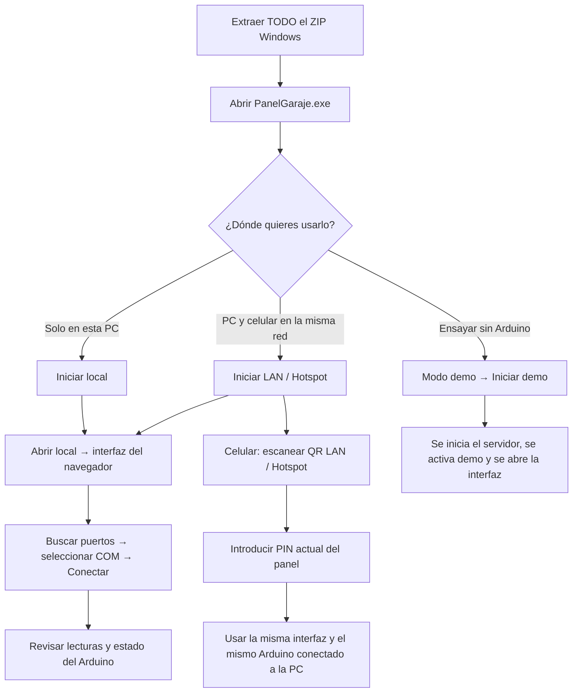
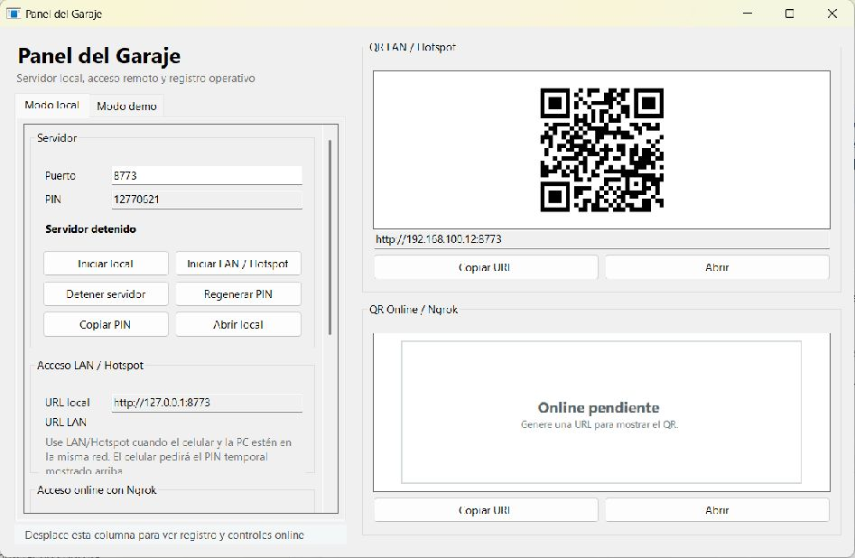
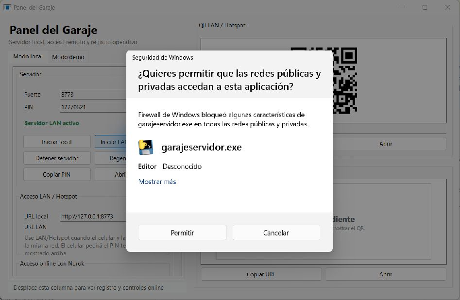

# Cómo iniciar el garaje y conectar el celular

[Volver al README](../README.md) · [Guía de la maqueta y cableado](GUIA_ILUSTRADA.md)

## 1. ¿Qué abrir primero?

**En el portable, abre primero `PanelGaraje.exe`.** Desde ese panel inicias el servidor y abres la interfaz del navegador. Después, en la interfaz, seleccionas el puerto COM y conectas el Arduino.



| Archivo o componente | Qué hace | ¿Lo abro manualmente para usar el portable? |
|---|---|---|
| `PanelGaraje.exe` | Administra servidor, modo de red, PIN y QR | **Sí, este es el punto de entrada recomendado** |
| `GarajeServidor.exe` | Sirve la interfaz web y comunica con el UNO | El panel lo inicia; no hace falta abrirlo aparte |
| `_internal` | Bibliotecas y archivos necesarios del servidor | Mantener la carpeta completa junto a los EXE |
| Interfaz del navegador | Conecta el COM, muestra sensores y controla/configura el garaje | Se abre con **Abrir local** o desde el celular |
| `INSTALAR_DEPENDENCIAS.cmd` / `INICIAR_SERVIDOR.cmd` | Preparan y ejecutan el código fuente con Python | Son para trabajar desde fuentes; el portable se usa desde el panel |
| Firmware del UNO | Ejecuta el ciclo de sensores y puerta en la placa | Se carga una vez y se vuelve a cargar cuando cambia el firmware |

El panel es la vía más sencilla, pero no es obligatorio para el servidor: `GarajeServidor.exe` puede iniciarse directamente y usa acceso local por defecto. En ese caso tú administras ese proceso y su configuración. Evita iniciar también el panel sobre el mismo puerto: el panel no adopta un servidor abierto por fuera y puede informar puerto ocupado.

El automatismo del UNO, una vez cargado, calibrado y habilitado según la configuración, funciona mientras la placa esté alimentada. Para supervisar desde PC o celular, la computadora y el servidor deben permanecer encendidos.

## 2. Reconocer el panel



La captura corresponde al portable publicado. La dirección de red y el PIN son los de una sesión de prueba ya detenida: usa siempre los valores de tu propio panel.

1. **Puerto:** inicialmente 8773. Es el puerto web; no es el número COM del Arduino.
2. **PIN:** código temporal para acceder desde el celular u otra computadora.
3. **Estado:** confirma si el servidor está detenido, local activo o LAN activo.
4. **Iniciar local:** habilita acceso desde esta computadora mediante `127.0.0.1`.
5. **Iniciar LAN / Hotspot:** habilita acceso desde esta PC y desde otros equipos de la red.
6. **Abrir local:** abre la interfaz web en el navegador de la PC; requiere el servidor iniciado.
7. **QR LAN / Hotspot:** contiene la URL de la computadora. El PIN se introduce por separado.

**El QR puede aparecer aunque el servidor esté detenido o iniciado solo en local.** Ver un QR no significa que el celular ya pueda entrar: confirma **Servidor LAN activo**.

## 3. Usarlo solo desde la computadora

1. Extrae todo `GarajeInteligente_v1.0.2_Windows.zip` a una carpeta y abre `PanelGaraje.exe`.
2. En la pestaña **Modo local**, pulsa **Iniciar local**.
3. Espera el estado verde **Servidor local activo**.
4. Pulsa **Abrir local**. El navegador abre inicialmente `http://127.0.0.1:8773`.
5. Con el firmware ya cargado, conecta el UNO por USB. Si no aparece COM y la placa usa CH340, sigue las instrucciones del driver incluido.
6. En la interfaz del navegador, pulsa **Buscar puertos**, selecciona el COM del UNO y pulsa **Conectar**. Cierra antes el monitor serie del Arduino IDE.
7. Comprueba que muestra Arduino conectado y lecturas actuales. La primera puesta en marcha requiere calibración de los servos; abrir el panel o conectar el COM no equivale a calibrar.


**Orden de los botones:** `Iniciar local → esperar estado activo → Abrir local → Buscar puertos → COM → Conectar`.

La URL `127.0.0.1` significa “este mismo equipo”. Si la escribes en el celular, intenta entrar al propio celular, no a la PC.

## 4. Conectar el celular en la misma red

Para conectar el celular **no necesitas iniciar local primero**: puedes iniciar directamente **LAN / Hotspot**. En modo LAN la PC también sigue pudiendo abrir la interfaz con **Abrir local**.

### Preparar la red

Conecta la PC y el celular a la misma red doméstica o escolar de confianza. La PC puede estar por Ethernet al mismo router y el celular por Wi-Fi. Evita una red de invitados que aísle los dispositivos.

También puedes usar un hotspot ya creado: conecta el otro dispositivo a esa red antes de iniciar LAN. El botón del panel **no crea ni activa un hotspot** y no configura el firewall de Windows. El uso en la misma red no requiere ngrok ni salida a Internet una vez que tienes el portable.

### Orden de inicio y acceso

1. Abre `PanelGaraje.exe`.
2. Si ya figura **Servidor local activo**, pulsa **Detener servidor** y espera **Servidor detenido**.
3. Pulsa **Iniciar LAN / Hotspot** y espera **Servidor LAN activo**. Si pulsas LAN con el servidor local aún activo, el programa conserva la instancia existente: hay que detenerla primero.
4. Si Windows solicita acceso de red, revisa el aviso. La conexión del teléfono necesita que el firewall permita el servidor en la red privada de confianza. La elección del permiso corresponde al usuario; el panel no la aplica automáticamente.
5. En la PC, pulsa **Abrir local**. Si trabajarás con la maqueta real, selecciona el COM y conecta el Arduino desde la interfaz.
6. En el celular, abre la cámara o lector QR y escanea **QR LAN / Hotspot**, el recuadro superior derecho del panel.
7. Abre el enlace leído. Si el teléfono no puede leer el QR, escribe en su navegador la **URL LAN** que muestra tu panel, incluyendo `http://` y `:8773` si ese es el puerto elegido.
8. Introduce el **PIN actual del panel** en la página de acceso del celular.
9. Comprueba que el teléfono muestra la misma interfaz y el mismo estado que la PC. El celular usa el Arduino conectado por USB a la computadora; no necesita instalar Python, el driver CH340 ni conectar otro Arduino.

```text
PC: Panel → Iniciar LAN / Hotspot → Abrir local → conectar COM del UNO
                 ↓
Celular en la misma red → QR LAN → navegador → PIN → interfaz compartida
```



La captura muestra el aviso que apareció durante la prueba de LAN. Se obtuvo sin aceptar permisos de red. El inicio del servidor se observó en la PC; esta sesión no verificó acceso desde un teléfono físico.

### Elegir la dirección correcta

En la captura aparece `http://192.168.100.12:8773` como ejemplo de la sesión de prueba. Tu PC puede tener otra IP. **No copies la IP ni el PIN de las capturas.**

El panel 1.0.2 elige automáticamente una IPv4 activa y genera el QR con ella; no incluye un selector de adaptador. Si hay VPN o varias redes, puede elegir una dirección distinta a la que comparte el celular. Verifica la IPv4 de la conexión correcta en Windows y prueba `http://IP-DE-TU-PC:PUERTO` desde el teléfono. Tras cambiar de red, reinicia el servidor para actualizar los datos.

## 5. Ensayar sin Arduino

En el panel, abre la pestaña **Modo demo** y pulsa **Iniciar demo**. Si no hay servidor activo, el panel inicia uno local, activa la simulación y abre el navegador. No necesitas conectar un COM.

Para mostrar la demo en el celular: inicia primero **LAN / Hotspot**, luego ve a **Modo demo → Iniciar demo**. Como el servidor ya está activo, el panel activa la simulación sobre esa misma instancia LAN. En el teléfono, entra por QR y PIN. Al terminar, usa **Detener demo** antes de conectar el Arduino real.

La demo se comparte entre PC y celular. Sus sensores, movimientos y guardados son simulados; no acreditan movimiento de motores ni escritura EEPROM física.

## 6. Si el teléfono no entra

| Qué ocurre | Qué revisar |
|---|---|
| Hay QR, pero el enlace no abre | Estado **Servidor LAN activo**; el QR existe también cuando el servidor está detenido o en local |
| Al pulsar LAN dice que ya está activo | Detener la instancia local y volver a iniciar en LAN |
| Abre en PC pero no en celular | Misma red, dirección LAN correcta, firewall y aislamiento de clientes del router |
| Se intenta usar `127.0.0.1` en el celular | Usar la URL LAN de la PC |
| PIN incorrecto | Usar el PIN actual del panel; si hubo muchos intentos, esperar antes de repetir |
| Puerto ocupado | Cerrar la instancia externa o usar otro puerto en el panel antes de iniciar |
| Interfaz abierta pero “Sin Arduino” | Conectar el COM desde el navegador; iniciar servidor no conecta automáticamente el UNO |
| Sigue mostrando datos de demo | Detener demo antes de conectar hardware real |

## 7. Al terminar

Si necesitas inhibir el automatismo de la maqueta, usa **Pausar / STOP** en la interfaz y confirma el estado. Después pulsa **Detener servidor** en el panel. Cerrar el navegador o detener el servidor no pausa el ciclo autónomo del UNO.

La pausa mantiene los pulsos y no corta corriente. Mantén la PC y USB alimentados mientras necesites comunicación. Regenerar el PIN requiere el servidor detenido y se aplica al siguiente inicio.

**Verificación de esta guía:** capturas del panel del release 1.0.2, inicio local confirmado e inicio LAN observado con aviso de firewall. No se aceptaron permisos del firewall, no se conectó Arduino ni se accionaron motores. El acceso desde un celular físico continúa pendiente.
